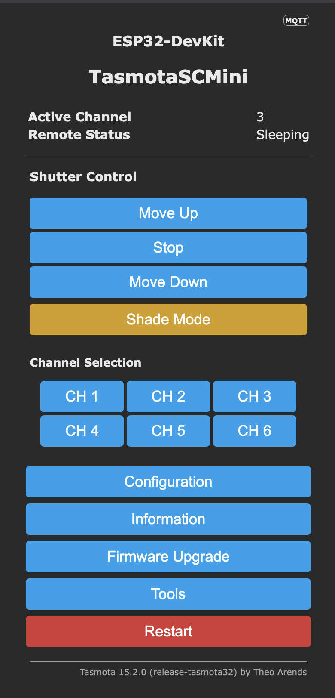
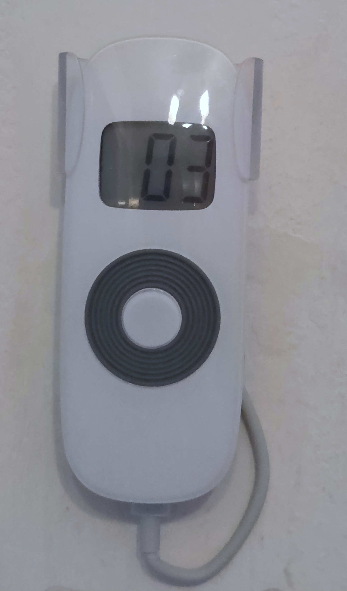
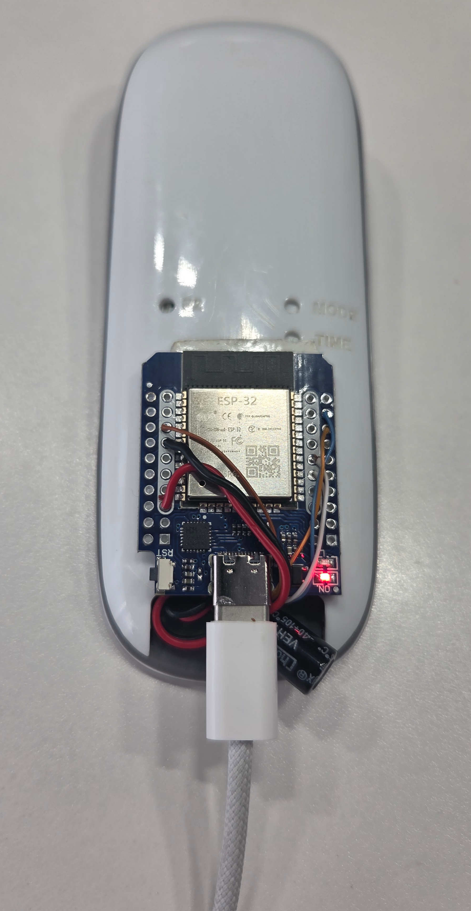
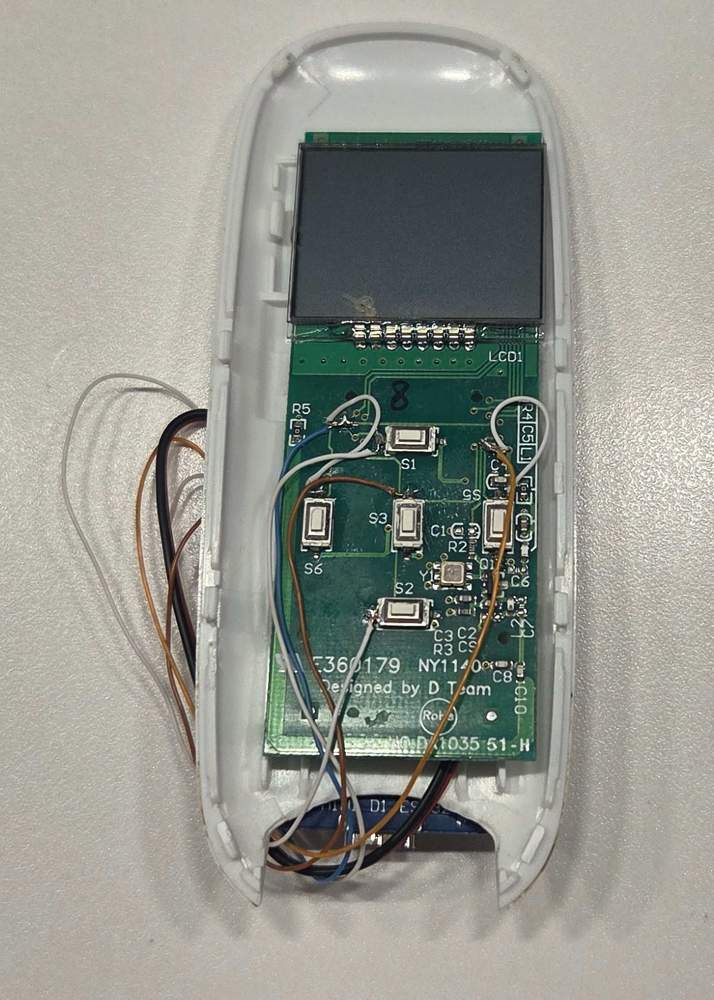
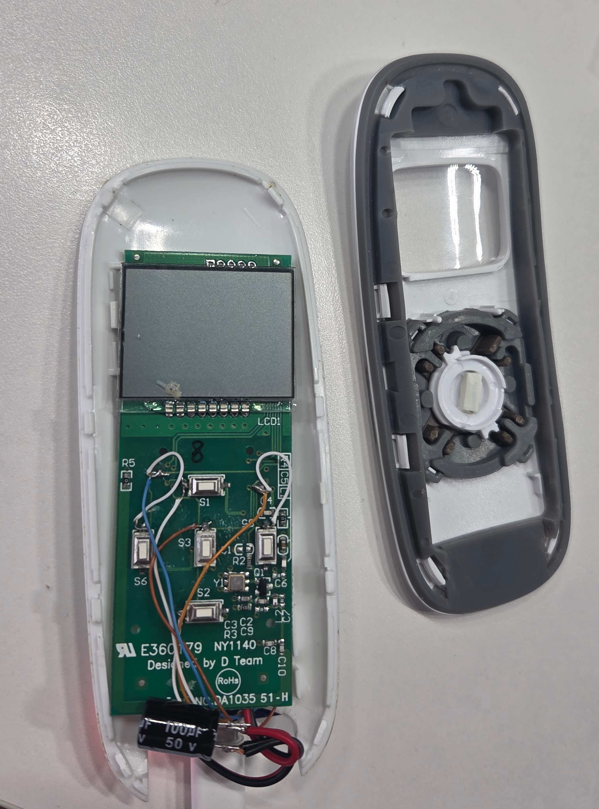
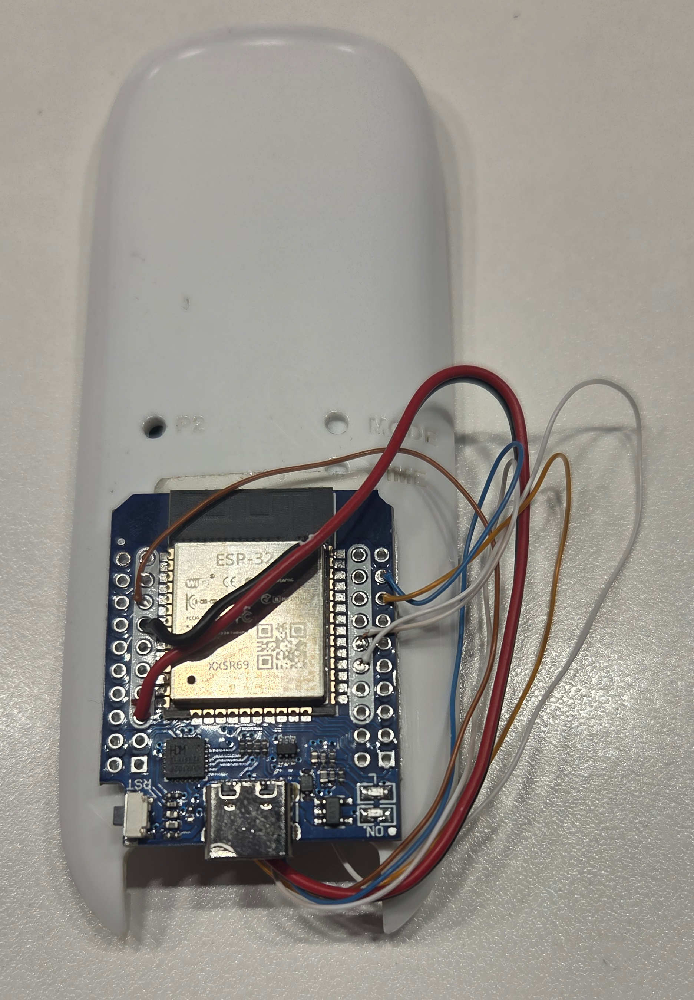

# 433MHz Multi-Channel Shutter Bridge for Tasmota (Berry)


This project provides a professional-grade bridge between **Tasmota (ESP32)** and proprietary **433MHz RF** multi-channel shutter remotes. It uses the Berry scripting language to handle complex channel-stepping logic, hardware synchronization, and specialized functions like the "Shade" (intermediate) position.

## 📟 Hardware Compatibility
Designed for the common 5-button 433MHz remote family (OOK/FSK) found in the shutter industry.


* **10-Channel LCD (Target Model)**: Displays channels `00` through `09`.
* **15-Channel LCD**: Displays channels `00` through `15`.
* **Model Note**: Also compatible with 5-channel LED variants as they share the same standby and wake-up logic.

### 📸 Build Gallery
| Tasmota WebGUI (max_chan = 6) |
| :---: |
|  |
| Home Assistant Dashoboard |
|  |

| Installed Hardware | Completed Build (Back) | 
| :---: | :---: | 
|  |  | 

| Component Wiring | PCB Detail |
| :---: | :---: |
|  |  |
| **Capacitor Mod** | **Final Assembly** |
|  |  |

## 🛠 Technical Implementation

### Open Drain (Open Gate) Parallel Wiring
The ESP32 is wired in parallel with the physical buttons of the remote. This is made possible by configuring the ESP32 GPIOs as **Output Open Drain**. In this state, the ESP32 only pulls the line to Ground (simulating a button press) or remains high-impedance (floating). 

### Synchronization & Manual Use
* **Hard Reset**: The ESP32 controls the remote's power (VCC). On boot, it performs a 4-second power cycle to force the remote back to its default starting channel.
* **Manual Parity**: Physical buttons remain functional thanks to the Open Drain configuration.

## ⛓️ Sequential Command Queuing

Because moving a specific shutter requires a sequence of pulses (Wake -> Step -> Move), the script uses a non-blocking FIFO queue.

| Step | Action | Description | Delay |
| :--- | :--- | :--- | :--- |
| 1 | **Wake-up** | Sends a `Stop` pulse to turn on the remote. | 800ms |
| 2 | **Step Right** | Pulse to move to the target channel. | 450ms |
| 3 | **Direction** | Sends the `Up/Down` pulse. | 250ms |

## 🔍 Details

### GPIO Mapping
The following pins are configured on the ESP32 to interface with the remote's micro-switches. By using **Open Drain**, we ensure the ESP32 doesn't interfere with the remote's internal logic or manual button presses.

| Function | ESP32 GPIO | Tasmota Component | Description |
| :--- | :---: | :--- | :--- |
| **Up** | GPIO 13 | User (Output) | Simulates 'Up' button press |
| **Down** | GPIO 12 | User (Output) | Simulates 'Down' button press |
| **Stop** | GPIO 14 | User (Output) | Simulates 'Stop' (also used for Wake-up) |
| **Step Left** | GPIO 27 | User (Output) | Decrements the channel (-) |
| **Step Right**| GPIO 26 | User (Output) | Increments the channel (+) |
| **Power/VCC** | **GPIO 18** | User (Output) | Powers the RC; used for hard reset/sync |

### Tasmota Configuration
Run these commands in the Tasmota Console. Setting the control pins to mode `2` (**Open Drain**) prevents the ESP32 from "holding" the remote's buttons high when not in use.

```tasmota
// Set Control Pins to Open Drain Mode
GpioConfig 13, 2
GpioConfig 12, 2
GpioConfig 14, 2
GpioConfig 27, 2
GpioConfig 26, 2

// Set Power Pin (GPIO 18) to Standard Output
GpioConfig 18, 1

// Global Settings
SetOption114 1 // Decouple Buttons from Relays
SetOption1 1   // Restrict Button multipress
```

### ⚡ Power Management & Sync Logic (`shutter.be`)
The `shutter.be` script utilizes **GPIO 18** to manage the remote's state. 
1. **Cold Boot**: On Tasmota startup, GPIO 18 is pulled LOW for 4 seconds and then HIGH.
2. **Hardware Sync**: This power cycle forces the remote to reset to its internal default (Channel 1).
3. **Software Sync**: The Berry script initializes its internal `current_channel` variable to `1` simultaneously, ensuring the bridge and physical remote are perfectly aligned without needing a two-way RF link.

### ⚡ Power Management
The remote is powered directly from the ESP32's 3.3V rail (or via the VCC GPIO through a transistor). The Berry script handles a **4-second cold boot** delay on startup to ensure the remote's LCD has stabilized before the first channel-sync pulse is sent.

### Synchronization & Manual Use
Since the remote buttons are still active, manual interaction is possible. However, because 433MHz is a one-way protocol, manual channel changes on the remote will not be detected by the ESP32. To maintain synchronization:
* **Hard Reset**: The ESP32 controls the remote's power (VCC). On boot, it performs a 4-second power cycle to force the remote back to its default starting channel.
* **Enhancement Path**: For users requiring 100% manual/software parity, the project could be modified by detaching the physical buttons from the remote's MCU and routing them as inputs into the ESP32 for full signal interception.

## ⛓️ Sequential Command Queuing

Because moving a specific shutter requires a sequence of pulses (Wake -> Step -> Move), the script uses a non-blocking FIFO queue. This ensures that pulses never overlap and the remote has sufficient time to process each "tap."

### Example: "Move Shutter 3 Down"
If the remote is currently on **Channel 1** and is in **Sleep mode**, a single `shutter_full 3,down` command triggers the following automated sequence:

| Step | Action | Description | Delay |
| :--- | :--- | :--- | :--- |
| 1 | **Wake-up** | Sends a `Stop` pulse to turn on the remote screen/LEDs. | 800ms |
| 2 | **Step Right** | Sends pulse to move from Ch 1 to Ch 2. | 450ms |
| 3 | **Step Right** | Sends pulse to move from Ch 2 to Ch 3. | 450ms |
| 4 | **Direction** | Sends the `Down` pulse on the now-active Ch 3. | 250ms |
| 5 | **Redundancy** | Sends a second `Down` pulse for reliability. | 550ms |


## 🏠 Home Assistant Integration

Integrate your shutters into Home Assistant using MQTT Template Covers and Sensors.

### 1. Cover Entity
Add this to your `configuration.yaml`.

```yaml
cover:
  - platform: mqtt
    name: "Living Room Shutter"
    command_topic: "cmnd/shutter_controller/shutter_full"
    state_topic: "stat/shutter_controller/STATE"
    availability_topic: "tele/shutter_controller/LWT"
    payload_open: "3,up"
    payload_close: "3,down"
    payload_stop: "3,stop"
    state_open: "Idle"
    state_closed: "Sleep"
    optimistic: true
```

### 2. Monitoring Sensors
Add these to track the active channel and bridge status in real-time.

```yaml
mqtt:
  sensor:
    - name: "Shutter Current Channel"
      state_topic: "stat/shutter_controller/CHANNEL"
      icon: "mdi:numeric"
    - name: "Shutter Bridge Status"
      state_topic: "stat/shutter_controller/STATE"
      icon: "mdi:remote"
```

### 3. Shade Helper (Script)
```yaml
script:
  shutter_shade:
    alias: "Set Living Room to Shade"
    sequence:
      - service: mqtt.publish
        data:
          topic: "cmnd/shutter_controller/shutter_full"
          payload: "3,shade"
```

---

## 🚀 Installation
1.  **Upload**: Place `shutter.be` and `webGUI.be` in the Tasmota File System.
2.  **Auto-Start**: Add `load("shutter.be")` and `load("webGUI.be")` to your `autoexec.be`.
3.  **Developer Note**: This script uses a **"Flat-If"** architecture to maintain high stability. This avoids the `elif` parser bug found in some Tasmota Berry versions, ensuring the script compiles and runs reliably on the ESP32-D0WD-V3 chipset.
